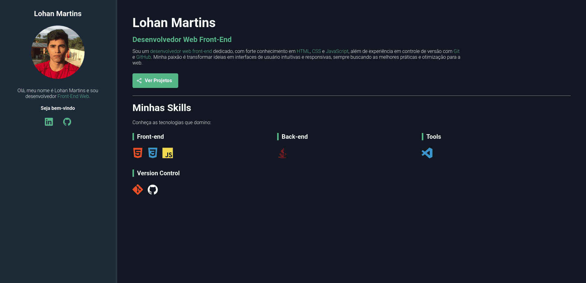

# Portfólio - Projeto

### Descrição
Projeto realizado durante o curso "Git e GitHub do básico ao avançado" do instrutor Mattheus Battist na plataforma de ensino Udemy.

### Aprendizado
Neste projeto, aprendi a utilizar diversas funcionalidades do Git e do GitHub, incluindo:
- Criar arquivos com o Git.
- Enviar arquivos para o repositório remoto.
- Visualizar alterações.
- Atualizar o repositório local com as mudanças do repositório remoto.
- Criar branches.
- Criar tags.
- Verificar mudanças entre arquivos.
- Entre outras.

### Exemplo ao vivo
**Link:** [Portfólio - Visualização](https://lohan-martins.github.io/)

### Imagem


### Como clonar o repositório
Para clonar este repositório, execute o seguinte comando no terminal:
```sh
git clone https://github.com/seu-usuario/nome-do-repositorio.git
